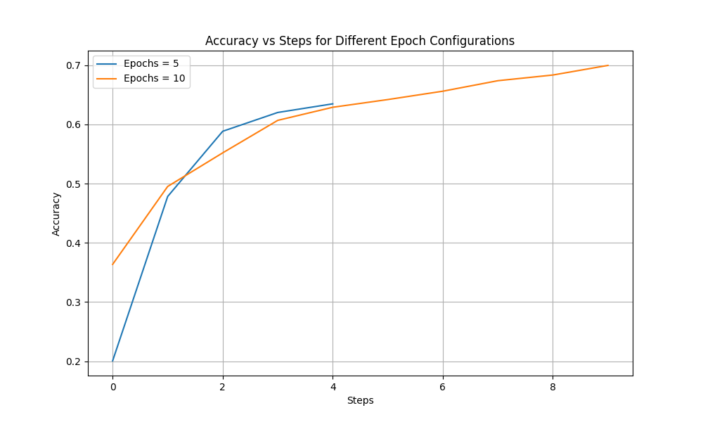
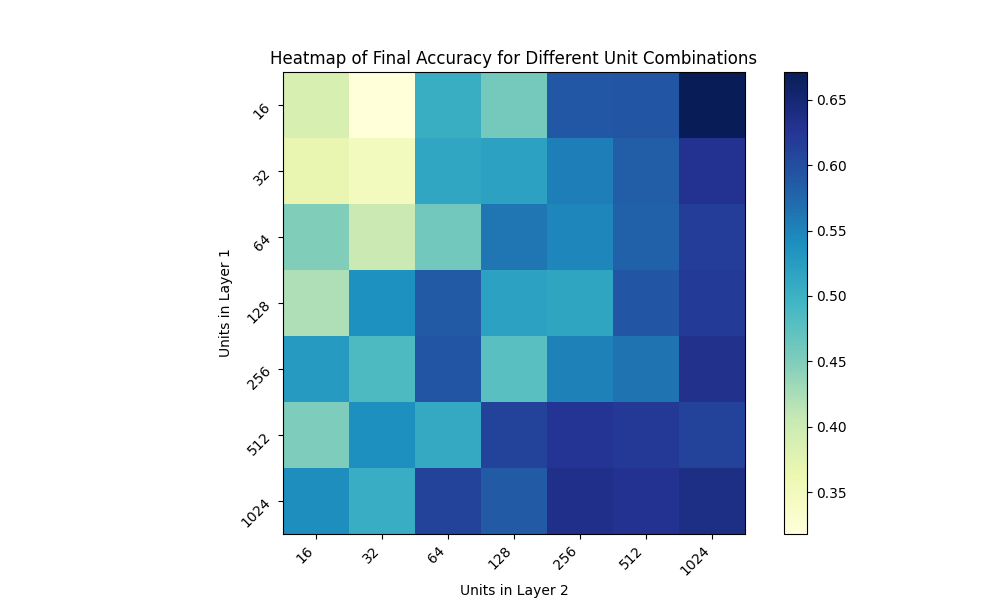
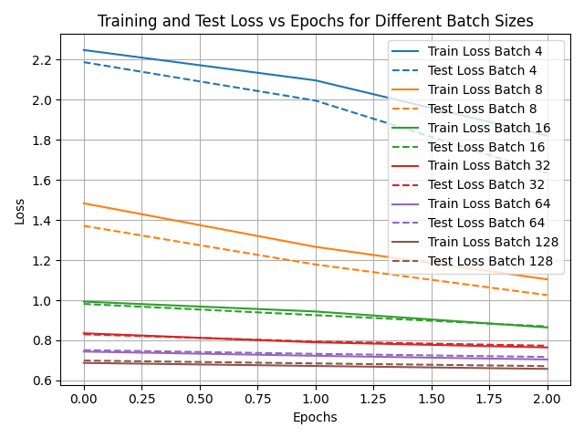
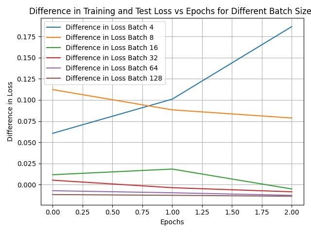
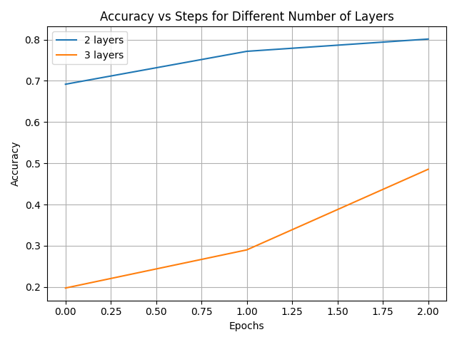
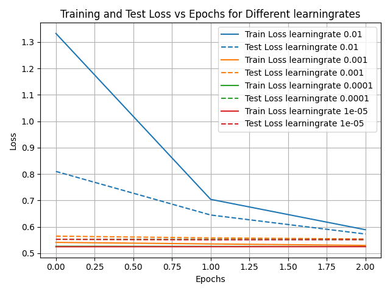
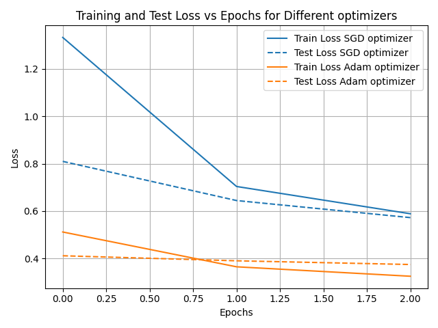

# Summary week 1
The goal of this experiment is to investigate how varying key hyperparameters, such as the number of epochs, units per layer, batch size, learning rate, and optimizer type, affect the performance of a neural network model. By systematically testing these parameters, the experiment provides insights into how model accuracy and training efficiency can be improve whil simultaneously avoiding problems such as overfitting or underfitting. Below I will first give my hypothesis for each hyperparameter, followed by the results of the experiment and the corresponding conclusions. Each time the same starting situation was assumed and the relevant hyperparameter was changed accordingly. More details can be found in the [notebook](./notebook.ipynb) and the [instructions](./instructions.md).

## Experiment
### Number of epochs
*Hypothesis*: I expect that increasing the number of epochs will improve model performance up to a point.  
*Findings*: Looking at the figure, it can be seen that accuracy does indeed increase as the number of epochs increases. Here is a plot showing the accuracy vs. steps for different epoch configurations:   

### Amount of units
*Hypothesis*: I expect that an increase in units will increase accuracy, but that this can also lead to overfitting with too high a number of units  
*Findings*:  The first layer has a stronger influence on model accuracy than the second layer. Here is a heatmap showing the accuracy for different amounts of units in the first and second layer:  

### Batchsize
*Hypothesis*: I expect that smaller batch sizes will lead to better generalization.  
*Findings*: Small batch sizes allow for better predictability of test data. However, beyond a certain size, the impact of batch size diminishes. Here are two plots showing the loss of the train and test set for different batchsizes:  

### Depth of model
*Hypothesis*: I expect that an increase in depth will increase accuracy, but after a certain point, performance will degrade due to overfitting.  
*Findings*: A model with more layers has better learning capacity than a model with fewer layers. Here is a plot showing the accuracy of a model with two and three layers:  

### Learningrate
*Hypothesis*: I expect that a learning rate that is too low will cause slow convergence.  
*Findings*: A higher learning rate means the model makes larger updates to the weights with each iteration. This can lead to a faster process. Here is a plot showing the loss of the train and test set for different learning rates:  

### Optimizer
*Hypothesis*: I expect that switching from SGD to Adam will improve the speed of convergence.  
*Findings*: SGD leads to faster initial convergence. Here is a plot showing the loss of the train and test for different optimizers:   

## Conclusion
The number of epochs required depends on whether configurations are still configuring. Once stagnation or overfitting occurs, no additional epochs are needed. The advantage of additional epochs is better configurations, higher accuracy, and the ability to detect overfitting. The disadvantage is that overfitting can occur, increasing computational costs.
Furthermore, this experiment used powers of 2 for tuning hyperparameters. The downside of this is that potentially optimal values ​​that don't fall below this parameter are overlooked. The advantage is a simpler search space and more efficient computational efficiency.

Below is an overview of the conclusion I drew based on this experiment.
* More epochs mean higher accuracy
* The first layer has a stronger influence on model accuracy than the subsequent layers
* A small batchsize leads to better generalization.
* More layers leads to a better learning capacity
* Higher learning rate = bigger steps
* SGD leads to faster initial convergence then Adam

[Go back to Homepage](../README.md)
