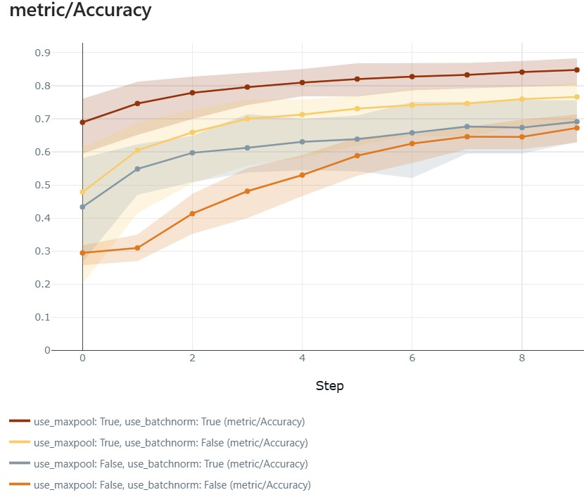
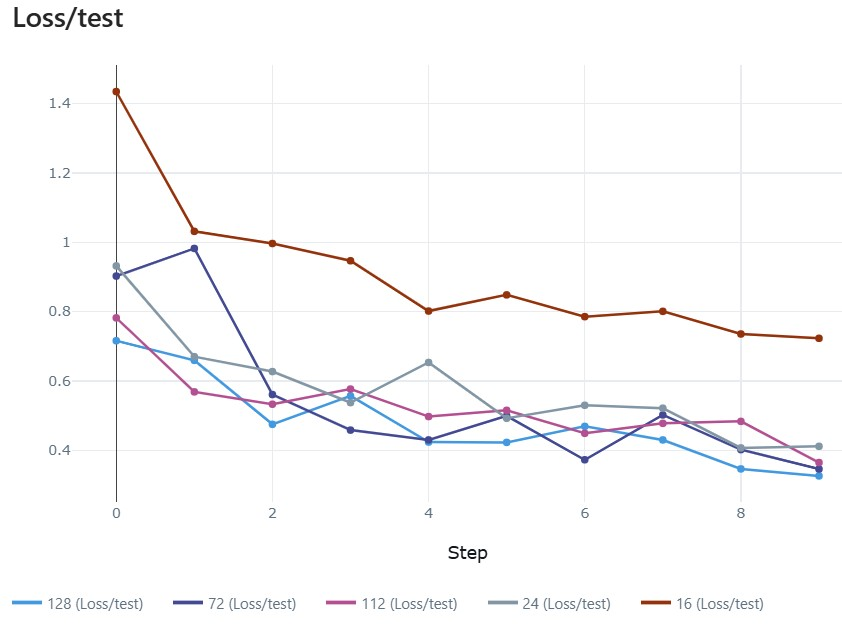
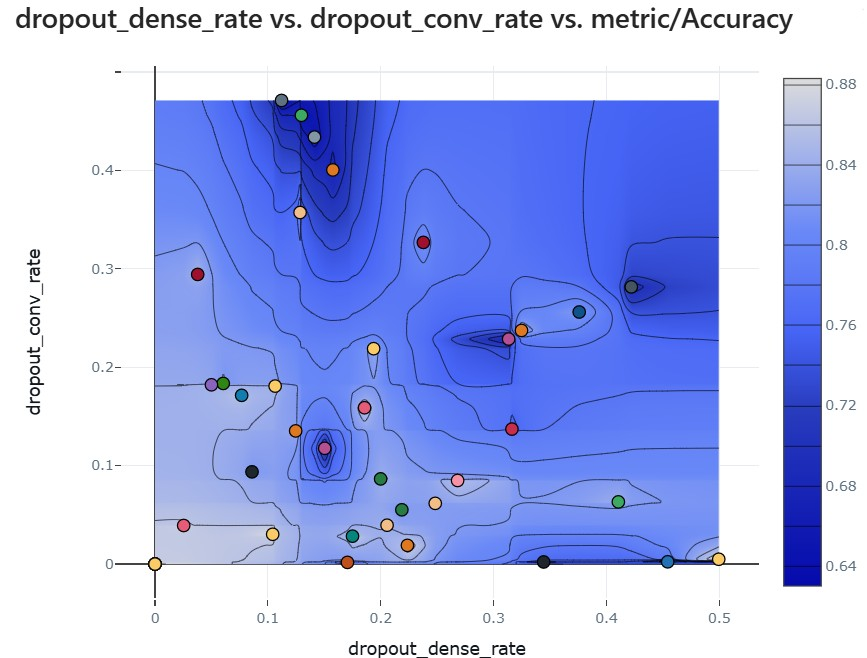

# Summary week 2
The goal of this experiment is to investigate the effect of adding different types of layers to the neural network. In this research, I experimented with adding dropout, batch normalization, convolutional layers, and pooling layers. Below, I will first preset my hypotheses, followed by the experimental design. Then, I will discuss the findings. Finally, I will summarize the conclusions. More details can be found in the [script](./functions.py) and the [instructions](./instructions.md).

### Hypothesis
Based on the course material, I formulated the following hypotheses prior to the experiment:
* Adding batch normalization and dropout layers after convolutional and linear layers will improve model generalization.
* By adding convolutional layers with pooling layers, the model is better able to capture spatial features in the data. This will improve accuracy in both the train and test data.

### Experiment
During the experiment, I experimented with adding and removing batch normalization, max pooling, and dropout. For dropout, I also experimented with different values ​​from the uniform distribution, with a minimum of 0.0 and a maximum of 0.5. Furthermore, I used different values ​​for the number of filters and units. The final result was evaluated based on accuracy. Furthermore, 10 epochs and a batch size of 64 were used throughout.

### Findings
The results show that adding both batch normalization and maxpooling layers improves the model. It's particularly striking that the initial loss for both the train and test sets is significantly lower. Furthermore, the results show that adding additional filters makes the model better able to detect the important properties. However, the figure below shows that at a certain point, the amount of influence a property has decreases. For this comparison, all situations were based on max pooling and batch norms, and dropout was not used. In addition, the effect of a dropout rate after both the maxpool layer and the linear layer was examined. This shows that a dropout rate has a positive effect on a model's performance. However, the probability of a value being set to null should not be too high, otherwise too much data would be lost. As shown in the figure, a combination of dropout in both locations results in better results.  

### Conclusion
Below is an overview of the conclusion I drew based on this experiment.
* Max pooling and batch normalization layers have a positive effect on the performance of the model
* Up to a certain point, more filters contribute to better model performance.
* Up to a certain point, a drop out contributes to better model performance.

[Go back to Homepage](../README.md)
