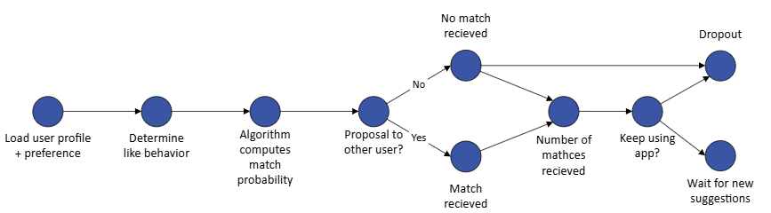

# Ethics
Below are two versions of my ethics assignments: one comparing two ethical models and one about the dating app Breeze. The instructions for both assignments can be found [here](./instructions.md).

## Assignment 1
### Comparing AI Ethics Maturity Model and IAMA in the context of data ethics
Since the advent of data science, there has been increasing attention to ethical question surrounding privacy, data collection and algorithmic decision-making (Floridi & Taddeo, 2016). There are several approaches including Utilitarianism and Kantian ethics that provide structured ways to determine whether an action is right or wrong (Rachels, 2012). Ethical models such as IAMA and AI Ethics Maturity Model can provide organizations with tools to apply this in practice within an organization.

#### Overview of each model
The AI Ethics Maturity Model is a framework that helps organizations structurally embed ethics in their AI practices. It consists of the dimensions of Awareness & Culture, Communication & Training, Development Processes, Governance, Policy, and Tooling. Each dimension has five levels of maturity. This allows organizations to gradually evolve toward a more responsible and ethically sound deployment of AI systems (Krijger et al., 2022).

Another model is IAMA (Impact Assessment Human Rights and Algorithms). This is a reflection tool developed by the Dutch government to help authorities ethically and legally assess algorithms. It identifies potential risks to fundamental rights and societal values and encourages conscious choices through a structured process of questions, reflection, and a fundamental rights assessment (Ministerie van Algemene Zaken, 2024).

#### Similarities and differences
Both models support organizations in deploying AI ethically, but they do so at different levels and with a different focus. The AI Ethics Maturity Model takes a broad and strategic view of the organization as a whole and focuses on gradually integrating ethics into policy, governance, culture, and processes, among other things (Krijger et al., 2022). IAMA, on the other hand, is a practical, project-oriented tool that helps organizations map and assess the human rights and ethical risks of a specific algorithm (Ministerie van Algemene Zaken, 2024).

In addition, the AI Ethics Maturity Model works with multiple dimensions and maturity levels to stimulate long-term capacity building, while IAMA focuses on a focused analysis with fixed reflection questions and a fundamental rights assessment (Krijger et al., 2022; Ministerie van Algemene Zaken, 2024).

In short, the maturity model supports organizations in structurally improving their ethical AI practices, while IAMA is a valuable tool for systematically assessing the ethical and legal risks of individual AI projects in advance.

#### Personal Preference
I prefer IAMA because, as a beginning data scientist, it offers a practical and concrete framework for structured reflection on the ethical and human rights aspects of their specific project. It helps identify significant risks early on without requiring extensive knowledge of broader organizational ethics. As a result, IAMA supports the development of an awareness of responsible AI applications in daily practice, which is essential for those still navigating the complex world of data science and ethics.
#### Suitability for Data Ethics
In my opinion, when it comes to data ethics for data scientists generally, IAMA is often more practical and immediately useful. It offers a hands-on, project-level framework that helps data scientists directly identify and address ethical and human rights risks related to the algorithms and data they work with. This concrete approach fits naturally into their workflow and decision-making process. On the other hand, the AI Ethics Maturity Model is more strategic and organizationally focused, aimed at embedding ethics across an entire company over time. While this is crucial for building a responsible AI culture, I find it less accessible for data scientists looking for actionable guidance on day-to-day ethical challenges. 

Both models play an important role in promoting ethics within AI, but for data scientists who work with algorithms daily, I believe IAMA offers the most practical and direct support. It makes ethics tangible and applicable, while the AI Ethics Maturity Model is particularly suited for strategic and organization-wide ethical development.

#### Literature
Floridi, L., & Taddeo, M. (2016). What is data ethics? Philosophical Transactions of the Royal Society a Mathematical Physical and Engineering Sciences, 374(2083), 20160360. https://doi.org/10.1098/rsta.2016.0360

Rachels, S. (2012). The elements of moral philosophy (7th ed.). McGraw-Hill. https://home.csulb.edu/~cwallis/382/readings/160/EM.pdf

Krijger, J., Thuis, T., De Ruiter, M., Ligthart, E., & Broekman, I. (2022). The AI ethics maturity model: a holistic approach to advancing ethical data science in organizations. AI And Ethics, 3(2), 355–367. https://doi.org/10.1007/s43681-022-00228-7

Ministerie van Algemene Zaken. (2024, August 20). Impact Assessment Mensenrechten en Algoritmes. Rapport \| Rijksoverheid.nl. https://www.rijksoverheid.nl/documenten/rapporten/2021/02/25/impact-assessment-mensenrechten-en-algoritmes

## Assignment 2
### Dating app Breeze
Breeze is a Dutch dating app that received a Human Rights Commission ruling in 2023 on whether it discriminates. An algorithm is used to determine a match probability for all users. It's notable that users of non-Dutch descent and darker skin receive fewer matches than other users (Dating-app Breeze Mag (En Moet) Algoritme Aanpassen Om Discriminatie Te Voorkomen | College Voor De Rechten Van De Mens, 2023).

Below, I will first discuss my initial impression of the ethical problem. Then, using a DAG, I will visually illustrate the choices, dependencies, and associated outcomes related to this dilemma. Based on this, I will indicate which aspects were not yet apparent during the initial assessment. Finally, a recommendation will be made to the data scientist who would be working on this assignment.

#### First impression of ethical issues
My initial impression of the ethical issues surrounding the dating app Breeze is worrying. As a company, you are liable for any algorithm you use. That's why I'm surprised they themselves lack insight into the consequences of the algorithm's use of like behavior. Since the algorithm uses feedback loops, this likely reinforces individual user biases, among other things. This is despite the fact that both user feedback and Breeze's own research show that the algorithm treats users unequally. Furthermore, it would be beneficial for transparency if Breeze had more insight into how its matching scores are calculated.

#### DAG for dilemma
Below, a directed acyclic graph visualizes the dependencies in this dilemma. It shows how the combination of liking behavior and user profile influences the match score. This, in turn, determines how many matches a user receives. Ultimately, this influences the group of people who use this app (Breeze Social B.V. Discrimineert Niet, Als Zij Maatregelen Neemt Die Voorkomen Dat Haar Algoritme Gebruikers Met Een niet-Nederlandse Afkomst of Donkere Huidskleur Benadeelt. | College Voor De Rechten Van De Mens, n.d.). 

The DAG has made it clearer to me how significant the feedback loop is. When users become dissatisfied due to unfair distribution and therefore stop using the app, the training data for that group becomes even smaller. This likely makes the algorithm even less able to learn the characteristics of that group.

#### Recommendation
When a data scientist starts working on this, it's crucial to understand the root cause of the problem. This means examining the input data and the data added during the process (De Eerlijkheid Van Algoritmes, 2025). Once the root cause of the problem has been determined, it's also crucial to assess whether the dataset being used is sufficiently representative (De Ree, 2021). 

Furthermore, it's important to measure fairness using fairness metrics. This allows for assessing whether certain users are being discriminated against compared to others (De Eerlijkheid Van Algoritmes, 2025). Furthermore, it's crucial to have experts review the results of an algorithm. A data scientist doesn't always possess sufficient knowledge of the subject. In such cases, feedback from experts can actually improve the algorithm's fairness and transparency. Even after receiving this feedback, it's essential to continue monitoring the results of an algorithm and adjust it if necessary (De Ree, 2021).

The Breeze case demonstrates how a well-intentioned matching app can produce discriminatory results through hidden feedback loops. With careful design and fairness assurance, data scientists must take responsibility for preventing algorithmic bias.

#### Literature
Breeze Social B.V. discrimineert niet, als zij maatregelen neemt die voorkomen dat haar algoritme gebruikers met een niet-Nederlandse afkomst of donkere huidskleur benadeelt. | College voor de Rechten van de Mens. (n.d.). https://oordelen.mensenrechten.nl/oordeel/2023-82

Dating-app Breeze mag (en moet) algoritme aanpassen om discriminatie te voorkomen \| College voor de Rechten van de Mens. (2023, September 6). College Voor De Rechten Van De Mens. https://www.mensenrechten.nl/actueel/nieuws/2023/09/06/dating-app-breeze-mag-en-moet-algoritme-aanpassen-om-discriminatie-te-voorkomen

De eerlijkheid van algoritmes. (2025, May 13). Tue. https://www.tue.nl/nieuws-en-evenementen/nieuwsoverzicht/13-05-2025-de-eerlijkheid-van-algoritmes

De Ree, M. (2021, April 29). Onderzoek naar eerlijke en uitlegbare algoritmen. Centraal Bureau Voor De Statistiek. https://www.cbs.nl/nl-nl/corporate/2021/17/onderzoek-naar-eerlijke-en-uitlegbare-algoritmen

[Go back to Homepage](../README.md)
